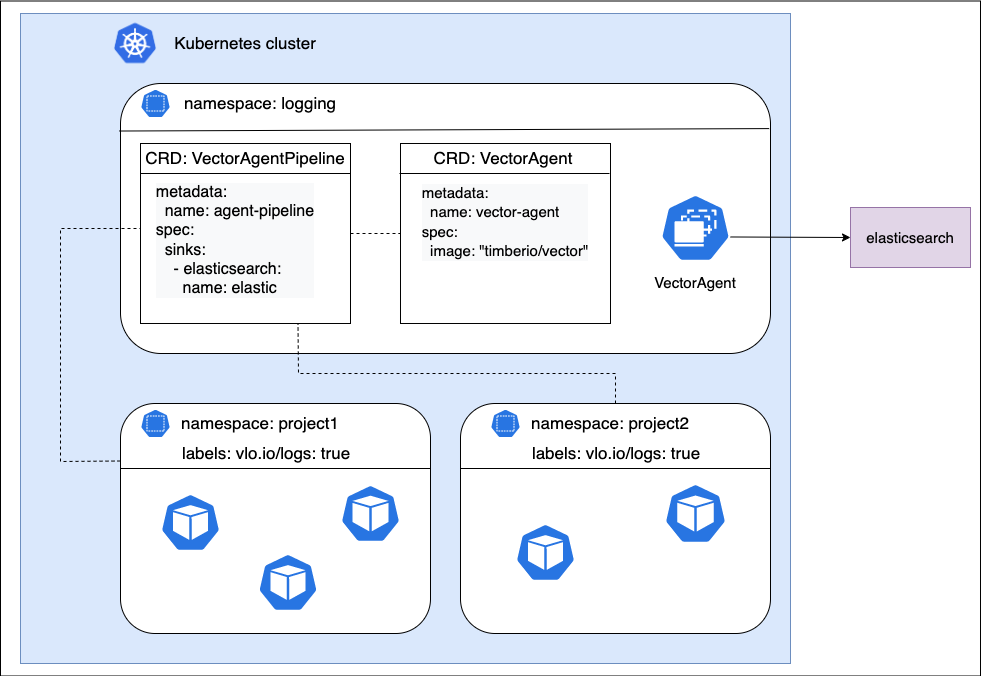

# Vector logging operator
The Logging operator automates the deployment and configuration of a Kubernetes logging. Operator uses vector instances for collecting, aggregating and storing logs into different systems.

## Work scheme


Ресурсы
* VectorAgent - описание инсталяции daemonset агентов с базовой конфигурацией
* VectorAgentPipeline - описание sinks и transforms
* VectorAggregator - описание statefulset агрегаторов с конфигурацией

VectorAgent и VectorAggregator могут создаваться и использоваться отдельно друг от друга

## How does it work?
* VectorAgent - defines parameters for run daemonset vector-agent instances
* VectorAgentPipeline - defines transforms and sinks sections for vector-agent
* VectorAggregator - defines parameters for run statefulset vector-agregator instances


Labels
Для сбора логов только с определенных неймспейсов не обходимо задать label `vlo.io/logs: "true"`. В таком случае будет
создан transform с названием namespaces, который может дальше использоваться, как input.
В случае создания агрегаторов label будет использоваться для запуска отдельных пулов под ns.

## Requirements
* Kubernetes >= 1.18
* cert-manager >= 1.5
* helm >= 3.0.0

## Установка
Установка может быть произведена с помощью helm или kustomize
```
kustomize edit set image controller=vlo/vector-operator:latest
kustomize build config/default | kubectl apply -f -
```

Helm
```
helm upgrade --install vector-operator ./charts
```